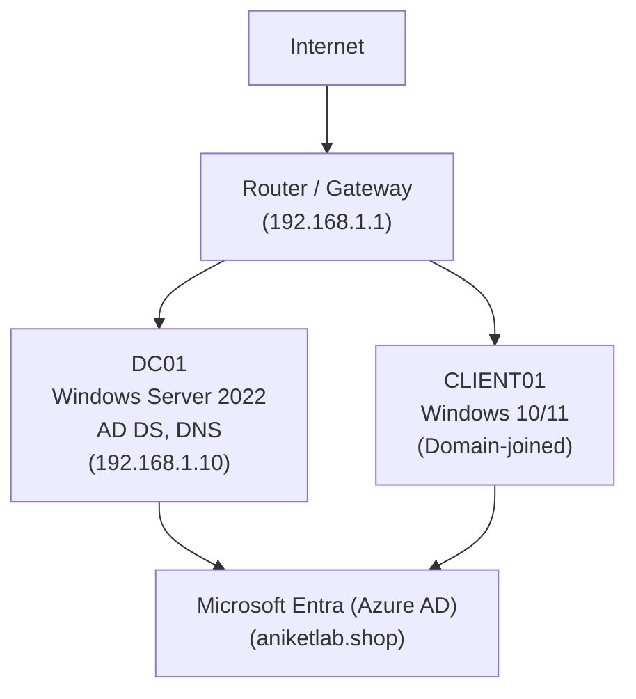

# Hybrid Cloud Identity Lab — `aniketlab.shop`

> **Professional hybrid-identity proof-of-concept**: on‑prem Active Directory (Windows Server 2022) synchronized to Microsoft Entra (Azure AD) with Azure AD Connect and **Seamless Single Sign-On (SSO)** for domain‑joined clients.  
> This repo contains step‑by‑step docs, verification commands, helper scripts, screenshots and a short demo plan so you can reproduce, demo and present the project professionally.

---

## Table of Contents
- [Overview](#overview)  
- [Why this matters (for hiring managers)](#why-this-matters-for-hiring-managers)  
- [Topology](#topology)  
- [Prerequisites](#prerequisites)  
- [Quick reproduction (summary)](#quick-reproduction-summary)  
- [Detailed install (full guide)](#detailed-install-full-guide)  
- [How to verify SSO (tests & commands)](#how-to-verify-sso-tests--commands)  
- [Screenshots to include (filenames)](#screenshots-to-include-filenames)  
- [Demo video: script & shot list (summary)](#demo-video-script--shot-list-summary)  
- [Troubleshooting checklist](#troubleshooting-checklist)  
- [Repository structure (what to push)](#repository-structure-what-to-push)  
- [Resume-ready summary (copy-paste)](#resume-ready-summary-copy-paste)  
- [License](#license)

---

## Overview
This project demonstrates a real-world **hybrid identity** deployment:

- Deploy an on‑prem Windows Server 2022 Domain Controller (`DC01`) running AD DS and DNS.  
- Configure internal DNS/DHCP and create Organizational Units + user accounts.  
- Verify and add the custom domain `aniketlab.shop` to Microsoft Entra (Azure AD).  
- Install **Azure AD Connect** (Password Hash Sync + Seamless SSO) to synchronize on‑prem users to Azure AD.  
- Validate Seamless SSO (Kerberos) from a domain‑joined Windows client to Azure apps (e.g., `myapps.microsoft.com` / Microsoft 365).

---

## Why this matters (for hiring managers)
This exercise demonstrates skills directly relevant to enterprise IT and cloud transition roles:
- Identity and access management (on‑prem and cloud).  
- Directory synchronization and authentication flows.  
- Troubleshooting infrastructure-level problems (DNS, Kerberos, time sync).  
- Practical experience with Microsoft enterprise tooling (Windows Server, Azure AD Connect, Microsoft Entra).

For candidates applying to infrastructure/cloud roles (e.g., Microland), this project shows you can design, deploy and validate a secure hybrid identity solution — exactly the kind of work done in managed services and cloud migration projects.

---

## Topology
Mermaid diagram (GitHub renders Mermaid diagrams in README):



**IP plan (example)**:
- `DC01` — `192.168.1.10` (static)  
- `CLIENT01` — DHCP or static in `192.168.1.100-200`  
- Router / gateway — `192.168.1.1`

---

## Prerequisites
- VMware Workstation (host machine) with virtualization enabled.  
- Windows Server 2022 ISO (Desktop Experience) and a Windows 10/11 ISO for the client VM.  
- Microsoft Entra (Azure) account with Global Administrator privileges.  
- Registered domain `aniketlab.shop` and access to DNS records at your registrar.  
- Optional: Microsoft 365 trial for a full SSO demo.  
- Basic familiarity with Windows Server GUI, Server Manager and PowerShell.

---

## Quick reproduction (summary)
1. Create VM for Windows Server 2022 (`DC01`) and install Desktop Experience.  
2. Rename to `DC01`, set static IP `192.168.1.10` and Preferred DNS to itself.  
3. Add AD DS role and promote to domain controller for `aniketlab.shop`.  
4. Configure DNS forwarders and (optionally) DHCP scope on the DC.  
5. Create OUs and users with UPNs `@aniketlab.shop`.  
6. Create Azure AD tenant (if not already) and verify `aniketlab.shop` via TXT record at your registrar.  
7. Install Azure AD Connect (custom install): Password Hash Sync + Enable Seamless SSO. Use Enterprise Admin creds when asked.  
8. Force sync: `Import-Module ADSync; Start-ADSyncSyncCycle -PolicyType Delta`.  
9. Create a Windows client VM, set DNS to `192.168.1.10`, join domain `aniketlab.shop`, login as `user@aniketlab.shop`.  
10. Open `https://myapps.microsoft.com` — expect silent sign-in (Seamless SSO).

For the full, beginner-friendly step-by-step reproduction see: `docs/INSTALL.md` (detailed instructions and exact GUI choices).

---

## Detailed install (full guide)
All step-by-step instructions, exact menu clicks and sample PowerShell commands live in:  
`docs/INSTALL.md` — **use this as your canonical install guide** (already included in this repo).

---

## How to verify SSO (tests & commands)
On a domain-joined client (logged in as an AD user):
- Browser test: open `https://myapps.microsoft.com` — expected: user is signed in automatically.  
- Kerberos check: open PowerShell and run:
```powershell
klist
```
You should see a valid TGT for the logged-in user.  
- Sync check (on AD Connect server):
```powershell
Import-Module ADSync
Start-ADSyncSyncCycle -PolicyType Delta
```
- DNS check:
```powershell
nslookup aniketlab.shop
Resolve-DnsName dc01.aniketlab.shop
```
- Time check (Kerberos dependency):
```powershell
w32tm /query /status
w32tm /resync
```

---

## Screenshots 
Place your screenshots in `/screenshots/` with these filenames — these are used in `docs/IMAGES.md`:
- `01-topology.png`  
- `02-dc-network-ip.png`  
- `03-ad-promotion.png`  
- `04-dns-forwarders.png`  
- `05-aduc-users-upn.png`  
- `06-azure-verify-txt.png`  
- `07-azuread-connect-wizard.png`  
- `08-azureadssocacc.png`  
- `09-sync-success.png`  
- `10-client-joined.png`  
- `11-myapps-ssosuccess.png`  
- `12-klist-output.png`

Add short captions under each image in `docs/IMAGES.md` (already included).

---

## Demo video: script & shot list (summary)
Produce a short 35–50s video (MP4) and a small GIF preview (4–6s) for README.

**Shot list (6–8 clips, 5–8s each)**:
1. Topology image (repo README) — introduce project.  
2. `ipconfig` on DC showing `192.168.1.10`.  
3. ADUC showing `rahul@aniketlab.shop` and `AZUREADSSOACC$`.  
4. Azure Portal showing `aniketlab.shop` verified.  
5. Run `Start-ADSyncSyncCycle` and show sync success / new user present in Azure AD.  
6. Client login as `user@aniketlab.shop`.  
7. Browser open to `myapps.microsoft.com` — demonstrates silent login.  
8. `klist` output showing Kerberos ticket + final repo link title card.


---

## Troubleshooting checklist (quick)
- **DNS**: Clients must use DC (`192.168.1.10`) as Preferred DNS. `nslookup` must resolve DC and domain.  
- **Clock**: Ensure time is within 5 minutes across DC and clients. `w32tm /resync`.  
- **Credentials**: Azure AD Connect’s on-prem credentials must be Enterprise Admin when creating the sync account.  
- **Network**: VMs must be on the same virtual network (same VMnet/Bond).  
- **Firewall / Proxy**: Allow outbound TCP 443 to Microsoft endpoints from AD Connect server.  
- **SSO prompts**: Ensure `AZUREADSSOACC$` exists; add `https://autologon.microsoftazuread-sso.com` to Local Intranet zone if needed.

---

## Repository structure
```
.
├── README.md                 # This file
├── LICENSE
├── docs/
│   ├── INSTALL.md            # Full step-by-step guide (canonical)
│   ├── TOPOLOGY.md
│   └── IMAGES.md
├── scripts/
│   ├── sync-now.ps1
│   └── check-time.ps1
├── screenshots/
│   ├── 01-topology.png
│   └── ...
├── assets/
│   └── demo-preview.gif
├── video/
│   └── demo.mp4 (optional - large files discouraged)
└── .gitignore
```

---

## License
This project is released under the **MIT License** — see `LICENSE`.

---

## Final notes
- `docs/INSTALL.md` is the canonical, step-by-step reproduction guide — use that when you follow or teach this lab.  
- The README is written to present the project professionally for recruiters and interviewers. 
---
