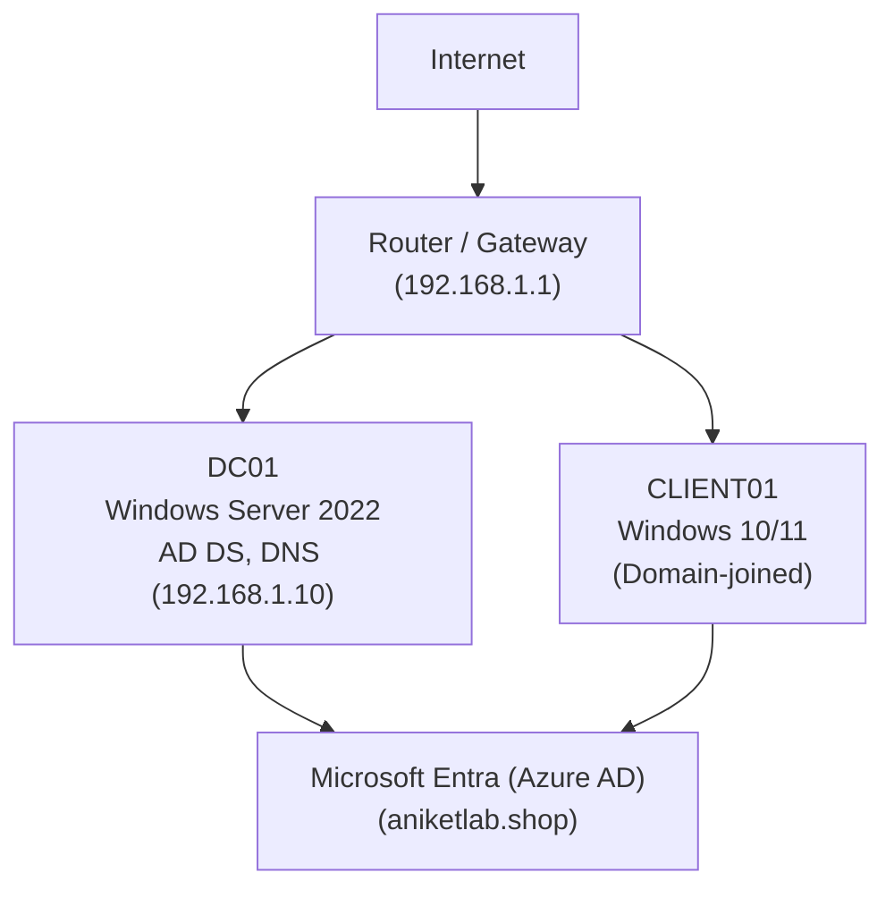

# TOPOLOGY.md

## Network topology (Mermaid)

## IP plan
- DC01: 192.168.1.10 (static)
- CLIENT01: DHCP or static in 192.168.1.100-200
- Router: 192.168.1.1

## Notes
- Use Bridged or Host-only VMnet consistently for both DC and client so they can reach each other.
